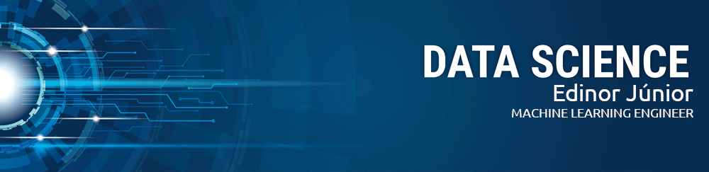

# Machine_Learning_Engineer
[](https://www.linkedin.com/in/edinorjr) [](https://www.python.org/downloads/release/python-365/) [](http://perso.crans.org/besson/LICENSE.html) [](https://github.com/zorrex82/Machine_Learning_Engineer)

<p align="center">
  
</p>

# DNA Nucleotide Count Data App
<sub>*Machine Learning Engineer</sub>

Data App project for DNA nucleotide counting based on a Course developed by Chanin Nantasenamat (aka Data Professor).
This project aims to show some of the power of streamlit to use libraries like pandas to handle data and the altair library to create data visualizations.
If you can, please contribute and share your knowledge.

**Some Screenshots from the project running**

<p align="center">
  
</p>

<p align="center">
  
</p>

<p align="center">
  
</p>

**How to proceed to running this app**

First install the dependencies

``` python

pip install -r requirements.txt

```
Then run the project with the command bellow

```python

streamlit run dna_app.py

```

**Links:**
* [LinkedIn](https://www.linkedin.com/in/edinorjr)
* [Pandas](https://pandas.pydata.org/)
* [Streamlit](https://www.streamlit.io/)
* [Altair](https://altair-viz.github.io/index.html)
---


